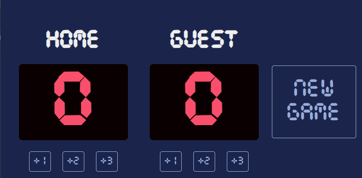

# 🏀 Basketball Scoreboard

A simple app to track the score of two teams (HOME and GUEST) using HTML, CSS, and JavaScript.

## ⚙️ Features

- Add 1, 2, or 3 points to each team
- "New Game" button to reset the scores
- Clean and minimal user interface
- Custom font included

## 🛠️ How to Use

1. Open `index.html` in your browser.
2. Click the buttons to add points.
3. Click "New Game" to reset the score.

## 📁 Project Files

- `index.html` – App structure
- `index.css` – Styles and layout
- `index.js` – Score logic
- `font.ttf` – Custom font used in the app

## 🖼️ Preview

---

Built as part of a Scrimba full stack path solo project challenge.
